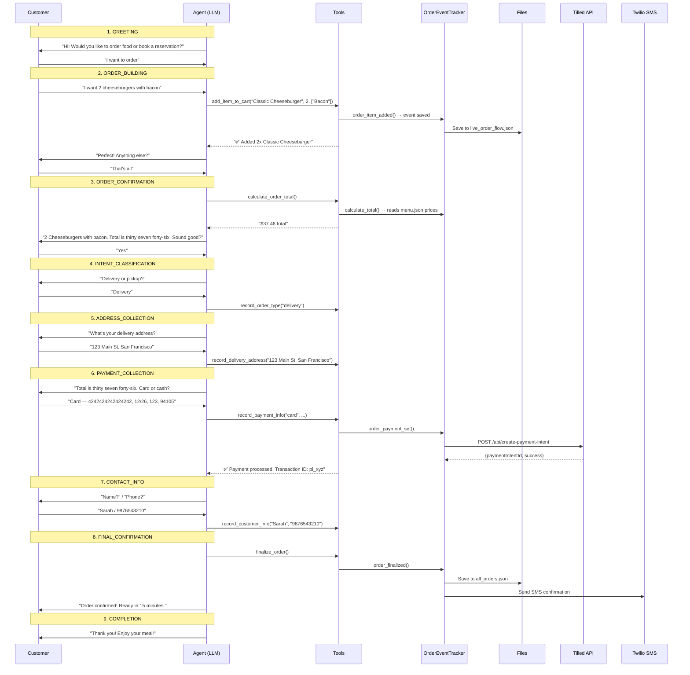

# IVR Service — End-to-End Architecture

> Comprehensive guide to how `apps/ivr-service` provisions phone numbers, handles PSTN & VoIP calls, performs AI-powered conversations with tool calling, and manages orders/reservations.

---

## Table of Contents

1. [High-Level Overview](#1-high-level-overview)
2. [Directory Structure](#2-directory-structure)
3. [Phone Number Provisioning (PSTN Setup)](#3-phone-number-provisioning-pstn-setup)
4. [Call Ingress — PSTN vs VoIP](#4-call-ingress--pstn-vs-voip)
5. [Agent Pipeline (STT → LLM → TTS)](#5-agent-pipeline-stt--llm--tts)
6. [System Prompt & algo.md Instructions](#6-system-prompt--algomd-instructions)
7. [How menu.json Powers the Agent](#7-how-menujson-powers-the-agent)
8. [Tool Calling — Function Tools](#8-tool-calling--function-tools)
9. [Order Lifecycle (End-to-End)](#9-order-lifecycle-end-to-end)
10. [Reservation Lifecycle](#10-reservation-lifecycle)
11. [OrderEventTracker — Event System](#11-ordereventtracker--event-system)
12. [Payment Processing](#12-payment-processing)
13. [SMS Confirmations](#13-sms-confirmations)
14. [Server API Surface (FastAPI)](#14-server-api-surface-fastapi)
15. [Deployment Architecture](#15-deployment-architecture)
16. [Environment Variables](#16-environment-variables)

---

## 1. High-Level Overview

The IVR Service is a real-time AI phone agent for restaurants. It handles:

- **Inbound PSTN calls** — a customer dials a Twilio phone number
- **VoIP (WebRTC) calls** — a customer connects from a web app
- **Outbound PSTN calls** — the agent dials out to a phone number

In all three cases, the same **LiveKit Agent** pipeline processes the call:

```
┌──────────────┐     ┌─────────────┐     ┌────────────┐     ┌──────────────┐
│  Customer    │────▸│  Twilio /   │────▸│  LiveKit   │────▸│  Agent       │
│  (Phone /    │     │  WebRTC     │     │  Server    │     │  (agent.py)  │
│   Browser)   │◂────│             │◂────│            │◂────│              │
└──────────────┘     └─────────────┘     └────────────┘     └──────────────┘
                                                                   │
                                                          ┌────────┴────────┐
                                                          │  Function Tools │
                                                          │  (16 tools)     │
                                                          └────────┬────────┘
                                                                   │
                                                          ┌────────▾────────┐
                                                          │ OrderEventTracker│
                                                          │ (order_tracker) │
                                                          └────────┬────────┘
                                                                   │
                                                    ┌──────────────┼──────────────┐
                                                    ▾              ▾              ▾
                                              JSON Files     Tilled API      Twilio SMS
                                           (orders, menu)   (payments)    (confirmations)
```

---

## 2. Directory Structure

```
apps/ivr-service/
├── .env.example                    # All required environment variables
├── docker-compose.yml              # 3 services: tilled-payment, voip, web
├── run.sh / start-local.sh         # Launch scripts
├── test-agent.py                   # Manual agent testing
├── docs/                           # Documentation
├── postman/                        # Postman collection
└── telephony/                      # ← Core application
    ├── Dockerfile / Dockerfile.agent / Dockerfile.server
    ├── requirements.txt            # Python deps (livekit, deepgram, openai, elevenlabs, etc.)
    ├── instructions/
    │   └── algo.md                 # IVR conversation algorithm (761 lines)
    ├── data/
    │   └── images/                 # Menu item images
    └── src/
        ├── server.py               # FastAPI server (3861 lines, 44+ endpoints)
        ├── agent.py                # LiveKit agent entrypoint + 16 function tools
        ├── helpers/
        │   ├── __init__.py
        │   ├── order_tracker.py    # OrderEventTracker — event system, cart, payments, SMS
        │   ├── admin.py            # Restaurant/owner CRUD, auth, file locking
        │   └── email_service.py    # SendGrid welcome emails
        └── pstn/
            ├── setup_twilio_livekit.py   # One-time PSTN provisioning script
            └── cleanup_livekit_sip.py    # Tear-down SIP resources
```

---

## 3. Phone Number Provisioning (PSTN Setup)

**File**: [setup_twilio_livekit.py](file:///Users/aiengineer/Desktop/Projects/Checkpoint/Parcera/apps/ivr-service/telephony/src/pstn/setup_twilio_livekit.py)

This is a **one-time, interactive CLI script** that wires a Twilio phone number to LiveKit so inbound PSTN calls reach the AI agent. It runs **6 steps**:

| Step | What it creates | Purpose |
|------|----------------|---------|
| **1/6** | LiveKit **Inbound Trunk** | Registers the phone number with LiveKit SIP. Generates an `origination_url` (`sip:{trunk_id}@sip.livekit.cloud`) |
| **2/6** | LiveKit **Dispatch Rule** | Maps calls on this trunk to a room with prefix `parcera-{phone_digits}-` and auto-dispatches the `mcd-agent` |
| **3/6** | Twilio **SIP Trunk** | Creates a SIP trunk in Twilio with domain `parcera-{phone_digits}.pstn.twilio.com` |
| **4/6** | Twilio **Credential List** | Creates SIP auth credentials (auto-generated username/password) and attaches to the trunk |
| **5/6** | LiveKit **Outbound Trunk** | For outbound calls — stores Twilio termination URI + auth credentials for dialing out from LiveKit |
| **6/6** | Links **Twilio → LiveKit** | Points the Twilio phone number's origination URL at the LiveKit SIP URI, binds the phone to the trunk |

### Key Design Decisions

- **No .env writes** — The outbound trunk ID is saved to `data/restaurants.json` under the matching restaurant's `sip_outbound_trunk_id` field. The agent reads this live per call.
- **No agent restart needed** — The agent reads `restaurants.json` at call time, not at startup.
- **Auto-generated credentials** — SIP username is `sip-{phone_digits}`, password is a random 28-char alphanumeric string stored only in Twilio.

### Input / Output

```
INPUT:   Phone number (+15551234567) + LiveKit SIP URI (3kxm9r7vbn4q.sip.livekit.cloud)
OUTPUT:  6 SIP resources created, sip_outbound_trunk_id saved to restaurants.json
```

---

## 4. Call Ingress — PSTN vs VoIP

**File**: [agent.py — entrypoint()](file:///Users/aiengineer/Desktop/Projects/Checkpoint/Parcera/apps/ivr-service/telephony/src/agent.py#L397-L523)

The `entrypoint()` function is the unified handler for all call types. LiveKit dispatches it when a participant joins a room.

### 4a. Inbound PSTN Flow

```
Customer dials → Twilio → SIP trunk → LiveKit room (parcera-{phone}-{uuid}) → Agent dispatched
```

1. Customer dials the provisioned Twilio number
2. Twilio routes the call via SIP trunk to the LiveKit SIP URI
3. LiveKit creates a room named `parcera-{phone_digits}-{uuid}`
4. The dispatch rule auto-dispatches `mcd-agent` to this room
5. `entrypoint()` is invoked, calls `ctx.wait_for_participant()`
6. Participant kind is `PARTICIPANT_KIND_SIP` → identified as PSTN
7. Caller phone is extracted from participant SIP attributes
8. Restaurant is identified by extracting the phone from the room name and looking it up in `restaurants.json`

### 4b. VoIP (WebRTC) Flow

```
Browser → POST /api/livekit/token → JWT token → Browser joins LiveKit room → Agent dispatched
```

1. Web frontend calls `POST /api/livekit/token` with `roomName` and `participantName`
2. Server creates/ensures the room exists with `mcd-agent` dispatch configured
3. Server generates a LiveKit JWT access token with audio publish/subscribe grants
4. Browser uses the token to join the room via WebRTC
5. `entrypoint()` is invoked, participant kind is not SIP → identified as VoIP

### 4c. Outbound PSTN Flow

```
Job metadata contains phone_number → Agent looks up outbound trunk → Dials via SIP
```

1. A job is created with metadata `{"phone_number": "+1..."}` 
2. `entrypoint()` reads this from `ctx.job.metadata`
3. Looks up `sip_outbound_trunk_id` from `restaurants.json` for that phone
4. Calls `ctx.api.sip.create_sip_participant()` to place the outbound call via LiveKit → Twilio → PSTN

---

## 5. Agent Pipeline (STT → LLM → TTS)

Once a participant joins (PSTN or VoIP), the same pipeline is used:

```python
session = agents.AgentSession(
    stt=deepgram.STT(model="nova-2"),          # Speech-to-Text
    llm=openai.LLM.with_azure(...),            # LLM (Azure OpenAI GPT-4)
    tts=elevenlabs.TTS(                        # Text-to-Speech
        voice_id="cgSgspJ2msm6clMCkdW9",
        model="eleven_flash_v2_5",
    ),
    vad=silero.VAD.load(                       # Voice Activity Detection
        min_speech_duration=0.05,
        min_silence_duration=0.35,
    ),
    preemptive_generation=True,
)
```

| Component | Service | Model / Config |
|-----------|---------|----------------|
| **STT** | Deepgram | `nova-2`, interim results enabled |
| **LLM** | Azure OpenAI | GPT-4, temperature 0.5 |
| **TTS** | ElevenLabs | `eleven_flash_v2_5`, stability 0.65 |
| **VAD** | Silero | 350ms silence threshold, 0.4 activation |
| **Noise Cancellation** | LiveKit BVC plugin | Optional — graceful fallback if unavailable |

### How it works per utterance:

1. **VAD** detects customer speech start/end
2. **STT** (Deepgram) transcribes audio to text in real-time (streaming)
3. **LLM** (Azure GPT-4) processes the text against the system prompt + algo.md instructions
4. If the LLM decides to call a tool → **tool function** executes → result returned to LLM
5. LLM generates a response
6. **TTS** (ElevenLabs) converts the response to audio with chunked streaming
7. Audio is sent back to the participant in the LiveKit room

---

## 6. System Prompt & algo.md Instructions

**File**: [algo.md](file:///Users/aiengineer/Desktop/Projects/Checkpoint/Parcera/apps/ivr-service/telephony/instructions/algo.md)

The system prompt is built at startup by combining:
1. **Date context** — current date for relative date parsing
2. **Menu availability rules** — strict instructions to only suggest available items
3. **algo.md** — the full IVR algorithm (with `{restaurant_name}` replaced)
4. **Dynamic menu text** — built from `menu.json` at startup
5. **Restaurant location & policies** — address, delivery radius, delivery fee, minimums

### algo.md defines two flows:

#### Food Order Flow (9 checkpoints)
```
GREETING → ORDER_BUILDING → ORDER_CONFIRMATION → INTENT_CLASSIFICATION
→ ADDRESS_COLLECTION → PAYMENT_COLLECTION → CONTACT_INFO 
→ FINAL_CONFIRMATION → COMPLETION
```

#### Reservation Flow (7 checkpoints)
```
GREETING → RESERVATION_DATE → RESERVATION_GUESTS → RESERVATION_TIME
→ RESERVATION_SUMMARY → RESERVATION_CONTACT → RESERVATION_CONFIRMATION → COMPLETION
```

The initial greeting asks the customer to choose between ordering food or booking a reservation, then follows the appropriate linear flow.

---

## 7. How menu.json Powers the Agent

**File**: [menu.json](file:///Users/aiengineer/Desktop/Projects/Checkpoint/Parcera/apps/ivr-service/telephony/data/menu.json) (loaded as `data/menu.json`)

`menu.json` is the **single source of truth** for everything the agent knows about the restaurant — its name, location, policies, and the full menu catalog. It is used at **three distinct moments**: agent startup, during tool calls, and during price calculation.

### 7a. menu.json Structure

The file has two top-level sections:

```json
{
  "business_context": {
    "name": "Burger Palace",
    "address": "456 Market St",
    "location": {
      "city": "San Francisco",
      "state": "CA",
      "zip_code": "94105"
    },
    "policies": {
      "min_delivery_order": 15,
      "delivery_fee": 3.99,
      "delivery_radius_miles": 5
    }
  },
  "catalog": {
    "categories": [
      {
        "id": "cat_appetizers_a1b2c3",
        "name": "Appetizers",
        "items": [
          {
            "id": "item_buffalo_wings",
            "name": "Buffalo Wings",
            "description": "Crispy wings tossed in buffalo sauce",
            "price": 12.99,
            "available": true,
            "image": "/images/buffalo_wings.jpg",
            "modifiers": [
              { "name": "Mild", "price": 0 },
              { "name": "Ranch", "price": 0.50 }
            ],
            "sizes": [
              { "name": "Small", "price": 8.99 },
              { "name": "Large", "price": 14.99 }
            ]
          }
        ]
      }
    ]
  }
}
```

### 7b. Startup Loading (Module Level — agent.py)

When `agent.py` is imported (at process startup, not per-call), it reads `menu.json` **once** into a module-level global:

```python
# agent.py — lines 21-33 (runs ONCE at process start)
BASE_DIR   = os.path.dirname(os.path.dirname(os.path.abspath(__file__)))
MENU_PATH  = os.path.join(BASE_DIR, 'data', 'menu.json')

with open(MENU_PATH) as f:
    BUSINESS_CONFIG = json.load(f)          # ← entire menu.json in memory

with open(ALGO_PATH) as f:
    IVR_ALGORITHM = f.read()

restaurant_name = BUSINESS_CONFIG['business_context']['name']
IVR_ALGORITHM   = IVR_ALGORITHM.replace('{restaurant_name}', restaurant_name)
```

> **Key point**: `BUSINESS_CONFIG` is a **global constant** — it is loaded once and shared by every call the agent handles. If menu.json is updated via the dashboard API, the agent must be restarted to pick up changes (since the module-level load only runs once).

### 7c. System Prompt Assembly — What the LLM Sees

The `SYSTEM_PROMPT` f-string is also built at module level, pulling data from `BUSINESS_CONFIG` in four ways:

```
┌──────────────────────────────────────────────────────────────────┐
│                     SYSTEM_PROMPT (f-string)                     │
│                                                                  │
│  1. Date context (datetime.now())                                │
│  2. Menu availability rules (hardcoded instructions)             │
│  3. IVR_ALGORITHM (algo.md with {restaurant_name} replaced)      │
│  4. build_menu_text()   ◄── reads BUSINESS_CONFIG.catalog        │
│  5. Restaurant location ◄── reads BUSINESS_CONFIG.business_context│
│  6. Business policies   ◄── reads BUSINESS_CONFIG.business_context│
└──────────────────────────────────────────────────────────────────┘
```

#### `build_menu_text()` — Converts menu.json to natural-language text

This function reads `BUSINESS_CONFIG['catalog']['categories']` and formats it into human-readable text that gets injected into the system prompt:

```python
def build_menu_text() -> str:
    r_name = BUSINESS_CONFIG['business_context']['name'].upper()
    menu_text = f"\n=== {r_name} MENU ===\n"
    for category in BUSINESS_CONFIG['catalog']['categories']:
        available = [i for i in category['items'] if i.get('available', True)]
        if available:
            menu_text += f"\n{category['name']}:\n"
            for item in available:
                menu_text += f"\n - {item['name']}: ${item['price']}\n"
                if item.get('sizes'):
                    menu_text += f"   Available sizes: {', '.join(s['name'] for s in item['sizes'])}\n"
                if item.get('modifiers'):
                    menu_text += f"   Available modifiers: {', '.join(m['name'] for m in item['modifiers'])}\n"
    return menu_text
```

The output looks like this in the LLM's system prompt:

```
=== BURGER PALACE MENU ===

Appetizers:
 - Buffalo Wings: $12.99
   Available sizes: Small, Large
   Available modifiers: Mild, Medium, Hot, Ranch, Blue Cheese

 - Loaded Nachos: $11.99
   Available modifiers: Chicken, Beef

Entrees:
 - Classic Cheeseburger: $14.99
   Available modifiers: Bacon, Avocado, Cheddar
...
```

> **Critical**: Only items with `available: true` are included. The LLM is explicitly instructed — via rules in the system prompt — to **never mention unavailable items**.

#### Business context injected into prompt

```python
SYSTEM_PROMPT = f"""
...
RESTAURANT LOCATION:
- Address: {BUSINESS_CONFIG['business_context']['address']}
- City:    {BUSINESS_CONFIG['business_context']['location']['city']}
- State:   {BUSINESS_CONFIG['business_context']['location']['state']}

BUSINESS POLICIES:
- Minimum delivery order: ${BUSINESS_CONFIG['business_context']['policies']['min_delivery_order']}
- Delivery fee:           ${BUSINESS_CONFIG['business_context']['policies']['delivery_fee']}
- Delivery radius:         {BUSINESS_CONFIG['business_context']['policies']['delivery_radius_miles']} miles
"""
```

This means the LLM knows the restaurant's exact address, can validate delivery zones (same city check), and can inform customers about delivery fees and minimums — all from menu.json.

### 7d. Runtime Usage — Tool Functions Read menu.json

During a live call, the agent's function tools reference `BUSINESS_CONFIG` in two ways:

#### 1. `find_menu_item()` — Item validation when adding to cart

```python
def find_menu_item(item_name: str) -> dict | None:
    lower = item_name.lower()
    for category in BUSINESS_CONFIG['catalog']['categories']:
        for item in category['items']:
            if item['name'].lower() == lower:
                return item
    return None
```

When the LLM calls `add_item_to_cart("Classic Cheeseburger", 2, ["Bacon"])`, the tool:
1. Calls `find_menu_item("Classic Cheeseburger")` → searches `BUSINESS_CONFIG` in memory
2. If not found → returns `"❌ {item_name} not found in menu."`
3. If found but `available: false` → returns `"❌ Sorry, {item_name} is currently unavailable."`
4. If found and available → adds to cart via `OrderEventTracker`

#### 2. `calculate_total()` — Re-reads menu.json from disk for prices

Unlike the agent (which uses the in-memory `BUSINESS_CONFIG`), the `OrderEventTracker.calculate_total()` method **re-reads `menu.json` from disk** every time it's called:

```python
def calculate_total(self) -> Dict[str, float]:
    with open('data/menu.json', 'r') as f:
        menu_data = json.load(f)     # ← fresh read from disk

    subtotal = 0.0
    for cart_item in self.cart_items:
        item_name = cart_item.get('item_name', '')
        quantity  = cart_item.get('item_quantity', 1)
        modifiers = cart_item.get('modifiers', [])

        # Find item in menu and get base price
        for category in menu_data['catalog']['categories']:
            for menu_item in category['items']:
                if menu_item['name'].lower() == item_name.lower():
                    item_price = menu_item['price']
                    # Build modifier + size price lookups
                    modifier_prices = {m['name'].lower(): m.get('price', 0.0) for m in menu_item.get('modifiers', [])}
                    size_prices     = {s['name'].lower(): s.get('price', 0.0) for s in menu_item.get('sizes', [])}
                    break

        # Sizes replace base price; modifiers add to it
        for mod in modifiers:
            if mod.lower() in size_prices:
                modifier_total += size_prices[mod.lower()] - base_price
            elif mod.lower() in modifier_prices:
                modifier_total += modifier_prices[mod.lower()]

        subtotal += (item_price + modifier_total) * quantity

    if self.order_type == "delivery":
        subtotal += self.delivery_fee   # $3.99

    tax   = subtotal * 0.08
    total = subtotal + tax
    return {"subtotal": subtotal, "tax": tax, "total": total}
```

> **Why re-read from disk?** The `OrderEventTracker` runs in a different context and doesn't import the agent's `BUSINESS_CONFIG` global. Re-reading ensures price accuracy even if the menu was updated via the dashboard API mid-session.

### 7e. Complete Data Flow Diagram

```
                    ┌──────────────┐
                    │  menu.json   │
                    │  (on disk)   │
                    └──────┬───────┘
                           │
           ┌───────────────┼──────────────────┐
           │               │                  │
     AT STARTUP      PER TOOL CALL     PER PRICE CALC
           │               │                  │
           ▾               ▾                  ▾
   ┌───────────────┐ ┌─────────────┐  ┌────────────────┐
   │ BUSINESS_CONFIG│ │find_menu_item│  │calculate_total()│
   │ (global dict)  │ │ (in-memory) │  │(re-reads disk) │
   └───────┬───────┘ └──────┬──────┘  └───────┬────────┘
           │                │                 │
     ┌─────┴──────┐   ┌─────┴──────┐   ┌──────┴──────┐
     │            │   │            │   │             │
     ▾            ▾   ▾            ▾   ▾             ▾
 build_menu    Business  add_item    remove   Subtotal +  Tax +
 _text()      location  _to_cart    _cart    delivery   total
     │        & policies   │         _item    fee
     │            │        │           │        │
     └────┬───────┘        └─────┬─────┘        │
          ▾                      ▾              ▾
   ┌─────────────┐        ┌──────────┐    ┌──────────┐
   │SYSTEM_PROMPT│        │Cart state│    │ Payment  │
   │(sent to LLM │        │(tracker) │    │ amount   │
   │ every turn) │        └──────────┘    └──────────┘
   └─────────────┘
```

### 7f. Summary — When menu.json Is Read

| When | What reads it | How | What's extracted |
|------|---------------|-----|------------------|
| **Agent process start** | `agent.py` module-level | `json.load()` → `BUSINESS_CONFIG` global | Everything: name, address, location, policies, full catalog |
| **System prompt build** | `build_menu_text()` | Reads `BUSINESS_CONFIG` in memory | Available items with prices, sizes, modifiers → formatted text |
| **System prompt build** | `SYSTEM_PROMPT` f-string | Reads `BUSINESS_CONFIG` in memory | Address, city, state, zip, delivery fee, min order, radius |
| **`add_item_to_cart()`** | `find_menu_item()` | Reads `BUSINESS_CONFIG` in memory | Item name match + availability check |
| **`calculate_order_total()`** | `OrderEventTracker.calculate_total()` | **Re-reads `menu.json` from disk** | Item base prices, modifier prices, size prices |
| **Dashboard menu APIs** | `server.py` (`load_menu()`) | Reads from disk | Full menu for CRUD operations |

---

## 8. Tool Calling — Function Tools

**File**: [agent.py — Function Tools](file:///Users/aiengineer/Desktop/Projects/Checkpoint/Parcera/apps/ivr-service/telephony/src/agent.py#L134-L391)

The LLM can invoke **16 function tools** during a conversation. Each is decorated with `@function_tool()` and takes a `RunContext`.

### Order Tools (10)

| Tool | Purpose | When Called |
|------|---------|-------------|
| `record_order_type(order_type)` | Records "delivery" or "pickup" | After order confirmation |
| `record_delivery_address(address_text)` | Records delivery address | Delivery orders only |
| `add_item_to_cart(item_name, quantity, modifiers)` | Adds menu item to cart | During order building |
| `update_cart_item(item_index, quantity, modifiers, special_instructions)` | Modifies an existing cart item | Customer changes their mind |
| `remove_cart_item(item_index)` | Removes item from cart | Customer removes an item |
| `calculate_order_total()` | Calculates subtotal + tax + delivery fee | Order confirmation step |
| `record_payment_info(payment_method, card_number, cvv, expiry, zipcode)` | Records & processes payment | Payment step |
| `record_customer_info(customer_name, customer_phone)` | Records contact info | Contact info step |
| `finalize_order()` | Submits order, triggers SMS + saves to all_orders.json | Final confirmation |
| `cancel_order(reason)` | Cancels the order | Customer says "cancel" |

### Reservation Tools (6)

| Tool | Purpose | When Called |
|------|---------|-------------|
| `record_reservation_date(date)` | Records reservation date (YYYY-MM-DD) | After customer provides date |
| `record_reservation_guests(guests)` | Records guest count (1-8) | After customer provides count |
| `check_available_times(preferred_time)` | Returns 3 available time slots | When customer states preferred time |
| `record_reservation_time(time)` | Records chosen time slot | Customer picks a time |
| `record_reservation_contact(name, phone, email, special_requests)` | Records contact + special requests | Contact collection step |
| `finalize_reservation()` | Confirms reservation, triggers SMS, saves to reservations.json | Final confirmation |

### How Tool Calling Works

```
Customer says: "I want 2 cheeseburgers with bacon"
       │
       ▾
STT transcribes → LLM receives text
       │
       ▾
LLM decides: call add_item_to_cart(item_name="Classic Cheeseburger", quantity=2, modifiers=["Bacon"])
       │
       ▾
Tool function validates item against menu.json, updates OrderEventTracker:
  - Emits "order.item_added" event
  - Updates cart_items list
  - Saves to live_order_flow.json
  - Returns: "✅ Added 2x Classic Cheeseburger. Cart now has 1 items."
       │
       ▾
LLM receives tool result → generates response:
  "Perfect! 2 Classic Cheeseburgers with bacon. Anything else?"
       │
       ▾
TTS speaks response
```

---

## 9. Order Lifecycle (End-to-End)



---

## 10. Reservation Lifecycle

Similar to the order flow but follows the reservation checkpoints:

1. **Date** → `record_reservation_date("2025-12-13")`
2. **Guests** → `record_reservation_guests(4)` — validates 1-8 range
3. **Time** → `check_available_times("17:00")` → returns 3 slots → `record_reservation_time("17:15")`
4. **Summary** → agent reads back details (no tool call)
5. **Contact** → `record_reservation_contact(name, phone, email, special_requests)`
6. **Confirmation** → `finalize_reservation()` → generates reservation ID (`RES-XXXX-NNNN`), saves to `reservations.json`, sends SMS

---

## 11. OrderEventTracker — Event System

**File**: [order_tracker.py](file:///Users/aiengineer/Desktop/Projects/Checkpoint/Parcera/apps/ivr-service/telephony/src/helpers/order_tracker.py)

A per-session tracker instantiated at the start of each call. It:

- Maintains an `events[]` list of `OrderEvent` dataclass instances
- Maintains a `cart_items[]` list for the active cart
- Persists events to `data/live_order_flow.json` after every event
- Saves finalized orders to `data/all_orders.json`
- Saves reservations to `data/reservations.json`

### Event Types

| Event | Description |
|-------|-------------|
| `session.created` | Call connected |
| `order.type_selected` | Delivery / pickup chosen |
| `order.address_set` | Delivery address recorded |
| `order.item_added` | Menu item added to cart |
| `order.item_updated` | Cart item modified |
| `order.item_removed` | Cart item removed |
| `order.payment_set` | Payment info captured (card or cash) |
| `order.customer_info_set` | Name + phone captured |
| `order.finalized` | Order submitted → SMS sent → saved to all_orders |
| `session.cancelled` | Order cancelled |
| `reservation.date_set` | Reservation date recorded |
| `reservation.guests_set` | Guest count recorded |
| `reservation.time_set` | Time slot recorded |
| `reservation.contact_set` | Name, phone, email, special requests |
| `reservation.finalized` | Reservation confirmed → SMS sent → saved to reservations.json |

### Data Files

| File | Purpose |
|------|---------|
| `data/live_order_flow.json` | Active/in-progress sessions (multi-session format) |
| `data/all_orders.json` | All finalized orders (append-only) |
| `data/reservations.json` | All finalized reservations |
| `data/menu.json` | Menu catalog + business context (used by agent + server) |
| `data/restaurants.json` | Restaurant configs, SIP trunk IDs, owner links |
| `data/owners.json` | Business owner accounts |

---

## 12. Payment Processing

Card payments go through the **Tilled Payment Service** (a separate Docker container on port 3000):

```
OrderEventTracker.order_payment_set()
  → calculate_total() (subtotal + tax + delivery fee)
  → _process_card_payment()
      → POST http://tilled-payment:3000/api/create-payment-intent
          payload: {session_id, restaurant_id, card_no, cvv, amount_cents, card_expiry, billing_zipcode}
      → Response: {paymentIntentId, orderId, clientSecret}
  → Store payment_intent_id + payment_status on the tracker instance
  → Return success/failure message to LLM
```

Cash payments simply record `payment_status: "pending_cash"` without an external API call.

---

## 13. SMS Confirmations

After `finalize_order()` or `finalize_reservation()`, the tracker sends an SMS via **Twilio**:

- **Order SMS**: Contains payment status, transaction ID, amount, order items, ready time, order ID
- **Reservation SMS**: Contains reservation ID, date, time, guests, customer name

The phone number is formatted with `+1` (US default) or `+91` for a specific test number.

---

## 14. Server API Surface (FastAPI)

**File**: [server.py](file:///Users/aiengineer/Desktop/Projects/Checkpoint/Parcera/apps/ivr-service/telephony/src/server.py) — 3861 lines, 44+ endpoints

The FastAPI server (`server.py`) runs alongside the agent and provides REST APIs for the web dashboard and frontends.

### Key Endpoint Groups

| Group | Endpoints | Purpose |
|-------|-----------|---------|
| **LiveKit** | `POST /api/livekit/token` | Generate JWT for VoIP WebRTC connections |
| **Orders** | `GET/DELETE /orders`, `GET /orders/latest`, `GET /orders/{session_id}` | Order CRUD from `all_orders.json` |
| **Order Status** | `PATCH /api/business/orders/{session_id}/status` | Update order status (confirmed → in-progress → completed) |
| **Reservations** | `GET/DELETE /reservations`, `GET /reservations/latest` | Reservation CRUD from `reservations.json` |
| **Events** | `GET /api/events`, `GET /api/events/{session_id}`, `GET /api/events/{session_id}/cart` | Live session events from `live_order_flow.json` |
| **Menu** | `GET /api/menu`, `GET /api/menu/{item_id}`, `POST/PATCH/DELETE /api/business/menu/items` | Full menu CRUD with file locking |
| **Sales Onboarding** | `POST /api/sales/onboard-restaurant`, `GET/DELETE /api/sales/restaurants` | Restaurant + owner creation, welcome emails  |
| **Business Auth** | `POST /api/business/login`, `POST /api/business/reset-password`, `GET /api/business/profile` | Owner authentication with SHA256 password hashing |
| **Analytics** | `GET /api/business/analytics/revenue` | Revenue analytics from order data |
| **Customer Cart** | `POST/PATCH/DELETE /api/customer/cart/*`, `POST /api/customer/checkout` | Web customer ordering flow |
| **OCR** | `POST /api/ocr/analyze`, `POST /api/ocr/extract-text`, `POST /api/ocr/analyze-url` | AWS Textract-based menu OCR |
| **Images** | `POST /api/upload-image`, `POST /api/serpapi/restaurant-images` | Image upload (S3) + SerpAPI restaurant image search |
| **Admin** | `POST /api/admin/clear-data` | Clear all data files |

---

## 15. Deployment Architecture

Defined in `docker-compose.yml` — 3 services on a shared Docker network:

```
┌────────────────────────────────────────────────────────────┐
│                    Docker Network (app-network)             │
│                                                            │
│  ┌─────────────────┐  ┌──────────────┐  ┌──────────────┐  │
│  │  tilled-payment  │  │     voip     │  │     web      │  │
│  │  (Node.js)       │  │  (Python)    │  │  (React+Nginx│  │
│  │  :3000 / :3001   │  │  :8000       │  │  :80 / :443  │  │
│  │                  │  │              │  │              │  │
│  │  Payment API     │  │  server.py   │  │  Dashboard   │  │
│  │  Webhooks        │  │  agent.py    │  │  Web frontend│  │
│  └─────────────────┘  └──────────────┘  └──────────────┘  │
│                              │                             │
│                    ┌─────────┴──────────┐                  │
│                    │ LiveKit Cloud       │                  │
│                    │ (external service)  │                  │
│                    └────────────────────┘                   │
└────────────────────────────────────────────────────────────┘
```

The **voip** container runs both `server.py` (FastAPI on port 8000) and `agent.py` (LiveKit agent worker). It mounts:
- `instructions/` as read-only
- `data/` as read-write (for orders, menu, restaurants, etc.)

---

## 16. Environment Variables

| Variable | Service | Purpose |
|----------|---------|---------|
| `LIVEKIT_URL` | Agent + Server | LiveKit Cloud WebSocket URL |
| `LIVEKIT_API_KEY` / `LIVEKIT_API_SECRET` | Agent + Server | LiveKit auth |
| `AZURE_OPENAI_*` | Agent | Azure OpenAI GPT-4 for LLM |
| `DEEPGRAM_API_KEY` | Agent | Speech-to-text |
| `ELEVENLABS_API_KEY` | Agent | Text-to-speech |
| `TWILIO_ACCOUNT_SID` / `TWILIO_AUTH_TOKEN` | Agent + Setup | Twilio for PSTN + SMS |
| `TWILIO_PHONE_NUMBER` | Agent | From-number for SMS |
| `TILLED_SECRET_KEY` / `TILLED_ACCOUNT_ID` | Tilled container | Payment processing |
| `SENDGRID_API_KEY` | Server | Welcome emails |
| `DASHBOARD_URL` | Server | Email link destination |
| `API_BASE_URL` | Server | Internal Docker service URL |
